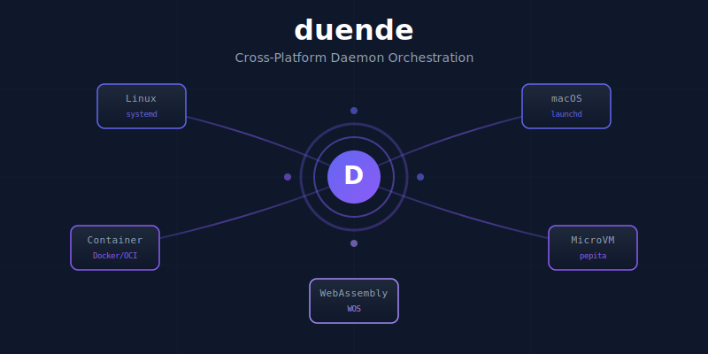

# duende

[](https://crates.io/crates/duende-core)
[](https://docs.rs/duende-core)
[](LICENSE)
[](https://github.com/paiml/duende)
[](https://github.com/paiml/duende)

<p align="center">
  
</p>

Cross-platform daemon framework for the PAIML Sovereign AI Stack.

## Quick Start

```bash
# Add to your project
cargo add duende-core

# Run the example daemon
cargo run --example daemon

# Run the mlock example (memory locking)
cargo run --example mlock
```

## Status

| Metric | Value | Falsification |
|--------|-------|---------------|
| Tests | 781 | `cargo test --workspace` |
| Coverage | 88.67% | `cargo llvm-cov --workspace` |
| Platforms | 6 of 6 | Native, Linux, macOS, Container, pepita, WOS |
| Falsification | F001-F110 | 110 Popperian falsification tests |

## Architecture

```
┌─────────────────────────────────────────────────────────────────┐
│                         Application                              │
├─────────────────────────────────────────────────────────────────┤
│                        duende-core                               │
│  ┌─────────────┐  ┌──────────────┐  ┌────────────────────────┐  │
│  │   Daemon    │  │ DaemonManager│  │    PlatformAdapter     │  │
│  │   Trait     │  │              │  │                        │  │
│  └─────────────┘  └──────────────┘  └────────────────────────┘  │
├─────────────────────────────────────────────────────────────────┤
│  Native │ Systemd │ Launchd │ Container │ Pepita │    WOS      │
│ (tokio) │ (Linux) │ (macOS) │(Docker/OCI)│(MicroVM)│ (WASM)    │
└─────────────────────────────────────────────────────────────────┘
```

## Example: Implementing a Daemon

```rust
use duende_core::{
    Daemon, DaemonConfig, DaemonContext, DaemonId,
    DaemonMetrics, ExitReason, HealthStatus, DaemonError
};
use async_trait::async_trait;
use std::time::Duration;

struct CounterDaemon {
    id: DaemonId,
    metrics: DaemonMetrics,
    counter: u64,
}

#[async_trait]
impl Daemon for CounterDaemon {
    fn id(&self) -> DaemonId { self.id }
    fn name(&self) -> &str { "counter-daemon" }

    async fn init(&mut self, _config: &DaemonConfig) -> Result<(), DaemonError> {
        println!("Initializing counter daemon...");
        Ok(())
    }

    async fn run(&mut self, ctx: &mut DaemonContext) -> Result<ExitReason, DaemonError> {
        while !ctx.should_shutdown() {
            self.counter += 1;
            println!("Counter: {}", self.counter);
            tokio::time::sleep(Duration::from_secs(1)).await;
        }
        Ok(ExitReason::Graceful)
    }

    async fn shutdown(&mut self, _timeout: Duration) -> Result<(), DaemonError> {
        println!("Shutting down with final count: {}", self.counter);
        Ok(())
    }

    async fn health_check(&self) -> HealthStatus {
        HealthStatus::healthy(5)
    }

    fn metrics(&self) -> &DaemonMetrics {
        &self.metrics
    }
}
```

## Memory Locking (DT-007: Swap Deadlock Prevention)

For daemons serving as swap backends (e.g., ublk devices), memory locking prevents deadlocks:

```rust
use duende_mlock::{lock_all, MlockConfig, lock_with_config};

// Lock all current and future allocations
let status = lock_all()?;
assert!(status.is_locked());

// Or with config for non-critical contexts
let config = MlockConfig::builder()
    .current(true)
    .future(true)
    .required(false)  // Don't fail if mlock fails
    .build();
lock_with_config(config)?;
```

**Container Requirements:**
```bash
docker run --cap-add=IPC_LOCK --ulimit memlock=-1:-1 your-daemon
```

## Platform Adapters

| Adapter | Status | Platform | Falsification |
|---------|--------|----------|---------------|
| NativeAdapter | ✅ | All | `cargo run --example daemon` |
| SystemdAdapter | ✅ | Linux | `systemctl --user status duende-*` |
| LaunchdAdapter | ✅ | macOS | `launchctl list \| grep duende` |
| ContainerAdapter | ✅ | All | `docker ps \| grep duende` |
| PepitaAdapter | ✅ | Linux+KVM | `pepita list \| grep duende-vm` |
| WosAdapter | ✅ | WOS | `wos-ctl ps \| grep duende` |

## Crate Overview

| Crate | Tests | Purpose |
|-------|-------|---------|
| `duende-core` | 352 | Daemon trait, manager, platform adapters |
| `duende-mlock` | 44 | `mlockall()` for swap safety (DT-007) |
| `duende-observe` | 78 | `/proc` monitoring, syscall tracing |
| `duende-platform` | 40 | Platform detection, memory helpers |
| `duende-policy` | 62 | Circuit breaker, jidoka, cgroups |
| `duende-test` | 45 | Test harness, chaos injection, mocks |
| `duende-ublk` | 45 | ublk device lifecycle, orphan cleanup |

## Development

```bash
# Build
cargo build

# Run all 781 tests
cargo test --workspace

# Iron Lotus quality tiers
make tier1    # fmt + clippy + check (<3s)
make tier2    # tests + deny (1-5min)
make tier3    # coverage + mutants
make tier4    # release + security

# Run examples
cargo run --example daemon
cargo run --example mlock

# Coverage report
make coverage
```

## Iron Lotus Framework

Duende follows the Iron Lotus Framework (Toyota Production System for Software):

- **Genchi Genbutsu**: All operations traceable to syscalls
- **Jidoka**: Explicit error handling, no panics in production code
- **Kaizen**: Continuous metrics via RED method (Rate, Errors, Duration)
- **Muda**: Zero-waste resource allocation

### Lint Policy

```toml
# Production code: deny unwrap/expect/panic
[workspace.lints.clippy]
unwrap_used = "deny"
expect_used = "deny"
panic = "deny"

# Test code: allowed for clear failure messages
#![cfg_attr(test, allow(clippy::unwrap_used, clippy::expect_used))]
```

## Roadmap

| ID | Title | Status | Falsification Criteria |
|----|-------|--------|------------------------|
| DP-001 | mlock() Memory Locking | ✅ Done | `lock_all()` returns `Ok(Locked{..})` |
| DP-002 | Linux systemd Adapter | ✅ Done | `systemctl --user status` shows managed unit |
| DP-003 | trueno-ublk Integration | 🔄 In Progress | ublk device serves I/O with memory locked |
| DP-004 | macOS launchd Adapter | ✅ Done | `launchctl list` shows managed service |
| DP-005 | Container Adapter | ✅ Done | `docker ps` shows managed container |
| DP-006 | pepita MicroVM Adapter | ✅ Done | `pepita list` shows managed VM |
| DP-007 | WOS Adapter | ✅ Done | `wos-ctl ps` shows managed process |

## Documentation

- [API Documentation](https://docs.rs/duende-core)
- [Book](https://paiml.github.io/duende)
- [Specification](docs/specifications/daemon-tools-spec.md)

## License

MIT
